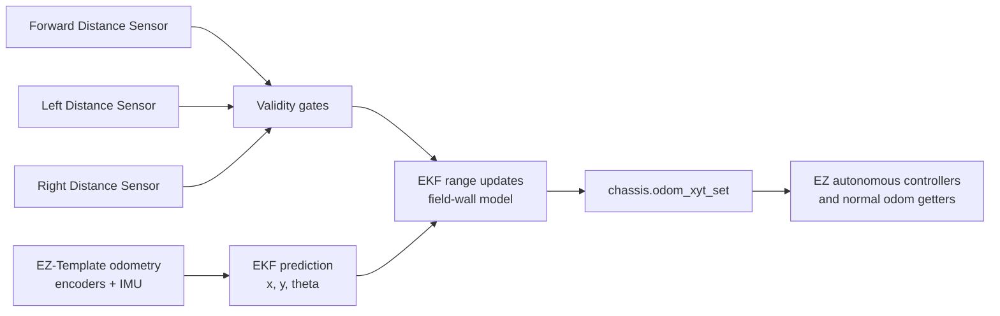

# Distance-sensor EKF odometry

## Purpose

This change adds a range-assisted Extended Kalman Filter (EKF) to the robot's
existing EZ-Template odometry. The goal is not to replace the drivetrain
encoders or IMU. Instead, it uses three V5 Distance Sensors to gently correct
encoder drift whenever a sensor has a believable, unobstructed view of a field
perimeter wall.

The estimator is designed for the 2026-27 V5RC Override field. Its field model
uses a 140.5 inch inside-wall dimension for the metal competition perimeter.
Use 140.4 inches for a portable perimeter.

## Files changed

| File | Responsibility |
| --- | --- |
| `include/distance_ekf.hpp` | Public start and reset functions. |
| `src/distance_ekf.cpp` | Sensor configuration, EKF state, range model, and 20 ms correction task. |
| `include/main.h` | Makes the EKF interface available throughout the project. |
| `src/main.cpp` | Starts the EKF after the chassis initializes and resets it with autonomous odometry. |

## Data flow



EZ-Template 3.2.2 does not expose the custom-odometry callback described in
newer EZ-Template documentation. Therefore, this implementation runs as a
separate 20 ms task. Each iteration reads the current EZ pose, applies range
corrections, and writes the corrected pose back with `chassis.odom_xyt_set()`.
Existing autonomous code continues to use normal EZ-Template calls:

```cpp
chassis.odom_x_get();
chassis.odom_y_get();
chassis.odom_theta_get();
chassis.odom_pose_get();
```

## Coordinate system and state

The state is:

```text
x = horizontal field position, positive to the robot's right at 0 degrees
y = forward field position, positive forward at 0 degrees
theta = heading in degrees, clockwise-positive
```

This matches EZ-Template's documented coordinate convention. For the wall
model to work, the autonomous start pose must use the robot center measured
from the inside west and south field walls. A generic `(0, 0, 0)` is only a
valid EKF start if the actual robot center is at that coordinate, which it
cannot be on a physical field.

The filter also stores a 3 by 3 covariance matrix for uncertainty in `x`, `y`,
and `theta`. It starts with standard deviations of 3 inches in position and 2
degrees in heading. Each 20 ms prediction adds small process uncertainty so a
later credible range observation can correct accumulated drift.

## Prediction

EZ-Template already integrates drivetrain encoders and the IMU. The EKF uses
the change in that pose between iterations as its motion prediction:

```text
state(k|k-1) = state(k-1|k-1) + delta(EZ odometry)
```

Large discontinuities (more than 24 inches or 45 degrees in one iteration)
are interpreted as an external pose reset instead of physical motion. The EKF
then reinitializes to EZ-Template's pose and restores its initial covariance.

## Range observation model

Each sensor has a position `(sensor_x, sensor_y)` on the robot and a bearing:

| Sensor | Bearing | Meaning |
| --- | ---: | --- |
| Forward | 0 degrees | Points through the front of the robot. |
| Left | -90 degrees | Points through the left side. |
| Right | +90 degrees | Points through the right side. |

The sensor mount point is rotated by the estimated heading and translated by
the estimated robot position. The resulting ray is intersected with the four
field walls. The shortest positive intersection is the expected range. This
is nonlinear in heading, so the code estimates the measurement Jacobian with
small numerical perturbations of `x`, `y`, and `theta`.

For each usable measurement `z`, the scalar update is:

```text
innovation = z - expected_range(state)
K = P H^T / (H P H^T + R)
state = state + K * innovation
P = P - K H P
```

`R` is set to 9 square inches (a 3 inch standard deviation). This intentionally
gives the encoder/IMU prediction meaningful weight; a single range reading
does not snap the robot to a wall.

## Sensor validation and safety gates

Distance Sensors can see game pieces, robots, goals, or nothing at all. The
filter only accepts a reading when all of these checks pass:

1. The range is between 1 and 78 inches. Values outside this range include the
   V5 no-target response and are ignored.
2. Readings beyond 200 mm have confidence at least 30 out of 63.
3. The sensor points mostly toward one field wall. Diagonal readings are
   rejected because their wall intersection is highly sensitive to heading.
4. The difference between the observed and predicted wall distance is at most
   10 inches and also lies inside a 3-sigma innovation gate.

These gates prevent most bad updates, but they cannot prove that a sensor is
looking at a wall. Do not aim a range sensor through scoring objects or use a
range correction while another robot is directly in its path.

## Required robot-specific configuration

The first section of `src/distance_ekf.cpp` contains the values that must be
measured on the real robot:

```cpp
constexpr std::uint8_t FRONT_DISTANCE_PORT = 8;
constexpr std::uint8_t LEFT_DISTANCE_PORT = 9;
constexpr std::uint8_t RIGHT_DISTANCE_PORT = 10;

constexpr double FRONT_SENSOR_X = 0.0;
constexpr double FRONT_SENSOR_Y = 0.0;
constexpr double LEFT_SENSOR_X = 0.0;
constexpr double LEFT_SENSOR_Y = 0.0;
constexpr double RIGHT_SENSOR_X = 0.0;
constexpr double RIGHT_SENSOR_Y = 0.0;
```

The listed ports are placeholders chosen because the current drivetrain and
IMU use ports 1 through 7. Replace them if the real wiring differs. Replace
the zero offsets with the distance, in inches, from the drivetrain rotation
center to the sensor's ranging origin:

- `x`: positive right, negative left
- `y`: positive forward, negative backward

For example, a sensor 7.25 inches in front of the rotation center has
`SENSOR_X = 0.0` and `SENSOR_Y = 7.25`.

## Lifecycle

`initialize()` calls `distance_ekf_start()` immediately after
`chassis.initialize()`. That starts one persistent background task.

`autonomous()` already clears EZ-Template's pose. It now immediately calls:

```cpp
distance_ekf_reset(start_x, start_y, start_theta);
```

Keep these values identical to the preceding `chassis.odom_xyt_set()` call.
For a real autonomous routine, replace both generic `(0, 0, 0)` values with
the measured field pose of the robot center.

## Calibration and bring-up procedure

1. Confirm each Distance Sensor reports a wall, rather than the robot or a
   field object, when it is expected to correct odometry.
2. Set the correct smart ports and physical offsets in `distance_ekf.cpp`.
3. Put the robot square against a known field location. Set matching EZ and
   EKF starting poses.
4. Drive straight toward and away from a clear wall. The reported `x` or `y`
   should converge toward the measured wall distance without jumps.
5. Repeat at headings where the forward, left, and right sensors each point
   close to a wall normal.
6. If corrections are too aggressive, increase `RANGE_VARIANCE`; if reliable
   readings barely correct drift, reduce it modestly. Do not lower gates until
   the physical sensor mounts are verified.

## Verification performed

- `git diff --check` passed.
- `make -n quick` confirms that the existing Makefile discovers and compiles
  `src/distance_ekf.cpp`.
- A target build could not run in this environment because
  `arm-none-eabi-g++` is not installed. The next validation step is a PROS
  toolchain build followed by the physical calibration procedure above.
